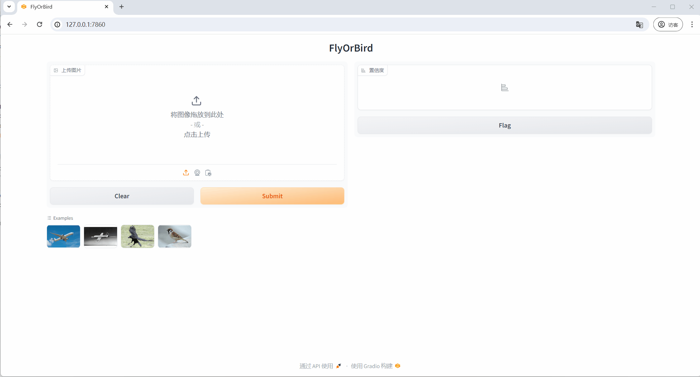

# FlyOrBird


`toy project` `resnet` `cifar10` `classification` `pytorch` `torchvision` `onxx` `gradio`   


Use cifar10 dataset bird and airplane to train a model, then convert the model to onnx format, and deploy the model with gradio.


### 0. Install Requirements

```shell
conda create -n flyorbird python=3.10
pip install torch torchvision gradio numpy onnxruntime-gpu
```
> Note: maybe is not enough, place by yourself.


### 1. Train Model

```shell
python train.py
```

### 2. Test Model

> pretrained model weights can get for [release](https://github.com/xx025/FlyOrBird/releases)

```shell
python test.py
```

### 3. Convert Model to ONNX

```shell
python convert2onnx.py
```

### 4. Deploy ONNX Model With Gradio

> onxx model can get for [release](https://github.com/xx025/FlyOrBird/releases)
```shell
python deploy.py
```

### 5. Test





